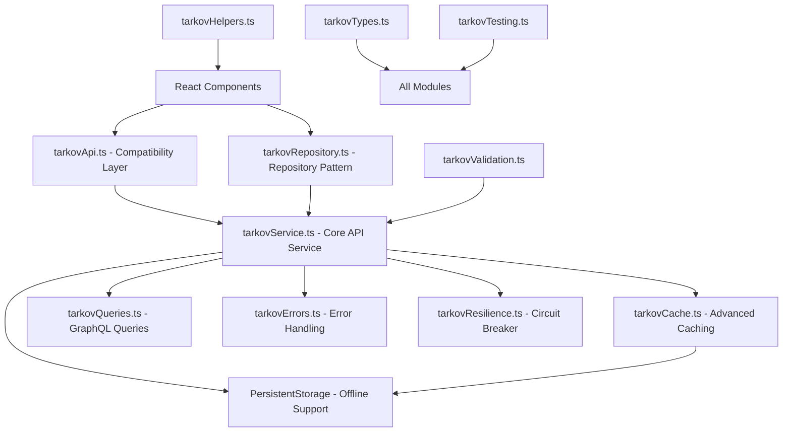
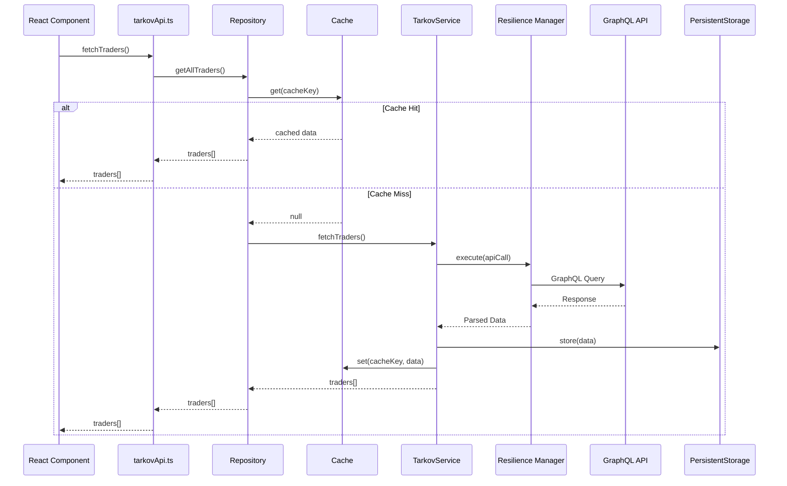
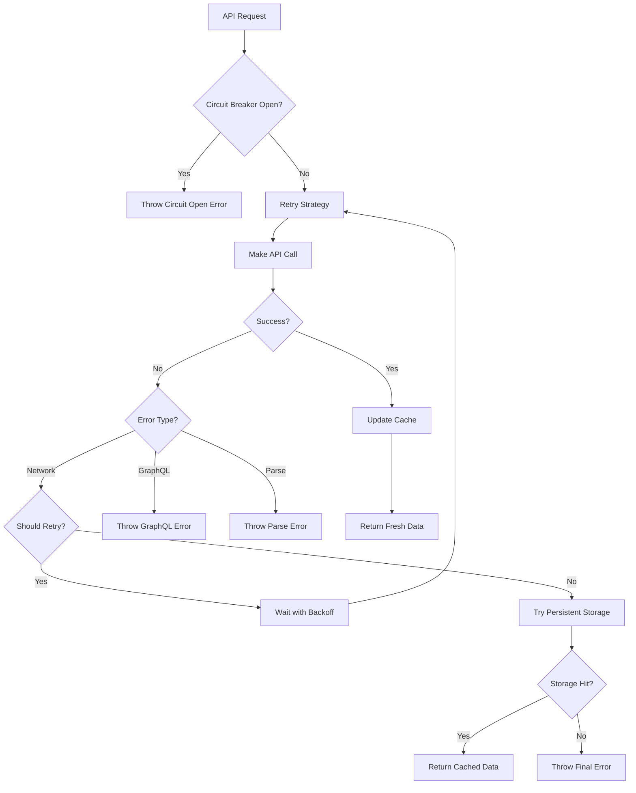

# Tarkov API Architecture Documentation

## 🏗️ **System Overview**

The Tarkov API system follows a **layered architecture** with clear separation of concerns, designed for maintainability, testability, and performance in a React Native environment.



## 📁 **Module Breakdown**

### Core Architecture Layers

#### **1. Presentation Layer**
- **React Components** (`app/(tabs)/*.tsx`, `components/*.tsx`)
- **Custom Hooks** (`hooks/useProgressData.ts`)
- **Context Providers** (`contexts/PlayerSettingsContext.tsx`)

#### **2. Service Layer**
- **`tarkovApi.ts`** - Backward compatibility facade
- **`tarkovRepository.ts`** - Repository pattern implementation
- **`tarkovService.ts`** - Core API communication service

#### **3. Infrastructure Layer**
- **`tarkovCache.ts`** - Advanced caching with TTL and deduplication
- **`tarkovResilience.ts`** - Circuit breaker and retry strategies
- **`tarkovErrors.ts`** - Custom error handling
- **`persistentStorage.ts`** - Offline data persistence

#### **4. Cross-Cutting Concerns**
- **`tarkovTypes.ts`** - TypeScript type definitions
- **`tarkovValidation.ts`** - Runtime validation and type guards
- **`tarkovHelpers.ts`** - Business logic utilities
- **`tarkovQueries.ts`** - GraphQL query definitions

#### **5. Testing Infrastructure**
- **`tarkovTesting.ts`** - Mock data and test utilities

## 🎯 **Design Patterns Used**

### **Repository Pattern**
```typescript
interface ITarkovRepository {
  getAllTraders(): Promise<Trader[]>;
  getQuestsByTrader(traderId: string): Promise<Quest[]>;
  // ... other methods
}
```

**Benefits:**
- Abstracts data source complexity
- Easy to mock for testing
- Consistent API regardless of data source (cache, API, storage)

### **Circuit Breaker Pattern**
```typescript
const result = await circuitBreaker.execute(() => apiCall());
```

**Benefits:**
- Prevents cascading failures
- Automatic recovery attempts
- Configurable failure thresholds

### **Strategy Pattern**
```typescript
const retryStrategy = new RetryStrategy(config);
await retryStrategy.execute(() => riskyOperation());
```

**Benefits:**
- Pluggable retry logic
- Different strategies for different operations
- Testable in isolation

### **Facade Pattern**
```typescript
// tarkovApi.ts provides a simplified interface
export const fetchTraders = (forceRefresh = false) => {
  return defaultTarkovService.fetchTraders({ forceRefresh });
};
```

**Benefits:**
- Backward compatibility
- Simplified API for common use cases
- Gradual migration path

## 🚀 **Data Flow**

### **Typical Request Flow**



### **Error Handling Flow**



## 🔧 **Configuration & Extensibility**

### **Service Configuration**
```typescript
const service = new TarkovService({
  apiUrl: 'https://api.tarkov.dev/graphql',
  timeout: 10000,
  retryAttempts: 3,
  retryDelay: 1000,
  cacheTtl: 5 * 60 * 1000,
});
```

### **Cache Configuration**
```typescript
const cache = new TarkovCache({
  ttl: 5 * 60 * 1000,       // 5 minutes
  maxEntries: 100,          // Memory limit
  enableDeduplication: true, // Prevent duplicate requests
  cleanupInterval: 2 * 60 * 1000, // Cleanup frequency
});
```

### **Resilience Configuration**
```typescript
const resilience = new ResilienceManager({
  // Circuit Breaker
  failureThreshold: 5,
  successThreshold: 3,
  timeout: 60000,
}, {
  // Retry Strategy
  maxAttempts: 3,
  baseDelay: 1000,
  maxDelay: 30000,
  backoffMultiplier: 2,
  jitter: true,
});
```

## 📊 **Performance Characteristics**

### **Caching Strategy**
- **L1 Cache**: In-memory with TTL (fastest)
- **L2 Cache**: Persistent storage (offline support)
- **L3 Source**: GraphQL API (slowest but fresh)

### **Request Deduplication**
```typescript
// Multiple simultaneous requests for same data = single API call
Promise.all([
  fetchTraders(), // API call made
  fetchTraders(), // Deduplication - waits for first call
  fetchTraders(), // Deduplication - waits for first call
]);
```

### **Query Optimization**
```typescript
// Single optimized query instead of multiple smaller ones
const allQuests = await getAllQuests(); // One API call
const kappaQuests = allQuests.filter(q => q.kappaRequired); // Local filtering
const praporQuests = allQuests.filter(q => q.trader.id === 'prapor'); // Local filtering
```

## 🛡️ **Error Recovery Strategies**

### **1. Graceful Degradation**
- API fails → Use cached data
- Cache empty → Use persistent storage
- Storage empty → Show meaningful error

### **2. Progressive Enhancement**
- Load basic data first (traders, quest names)
- Load detailed data on demand
- Prefetch likely-needed data in background

### **3. Circuit Breaker Protection**
- Temporary failures don't cascade
- Automatic recovery when service improves
- Configurable failure thresholds

## 🧪 **Testing Strategy**

### **Unit Tests**
- Pure functions (helpers, validators)
- Individual service methods
- Error handling scenarios

### **Integration Tests**
- Repository pattern with real/mock services
- Cache behavior with different scenarios
- End-to-end data flow

### **Mock Infrastructure**
```typescript
// Easy mocking for any test scenario
const mockRepo = new MockTarkovRepository({
  traders: [mockTrader1, mockTrader2],
  quests: [mockQuest1, mockQuest2],
});

// Deterministic test data
const testData = TestUtils.generateDeterministicData(
  () => MockDataGenerators.createQuestTree(3, 2),
  'test-seed-123'
);
```

## 🔮 **Future Extensions**

### **Planned Enhancements**
1. **Real-time Updates** - WebSocket support for live data
2. **Offline-first** - Complete offline functionality
3. **Data Synchronization** - Conflict resolution for offline changes
4. **Analytics** - Performance metrics and usage tracking
5. **Plugin System** - Extensible data processors

### **Extension Points**
```typescript
// Custom data processors
interface IDataProcessor<T> {
  process(data: T[]): Promise<T[]>;
}

// Custom cache backends
interface ICacheBackend {
  get<T>(key: string): Promise<T | null>;
  set<T>(key: string, value: T, ttl?: number): Promise<void>;
}

// Custom error handlers
interface IErrorHandler {
  canHandle(error: Error): boolean;
  handle(error: Error): Promise<any>;
}
```

## 📈 **Monitoring & Observability**

### **Built-in Metrics**
```typescript
const metrics = globalCache.getStats();
const resilience = globalResilienceManager.getMetrics();

console.log({
  cacheHitRatio: metrics.hits / (metrics.hits + metrics.misses),
  averageResponseTime: resilience.requests.averageResponseTime,
  circuitBreakerStatus: resilience.circuitBreaker.state,
});
```

### **Health Checks**
```typescript
const health = await HealthCheck.performHealthCheck();
console.log(health.status); // 'healthy' | 'degraded' | 'unhealthy'
console.log(health.recommendations); // Actionable suggestions
```

## 🔒 **Security Considerations**

### **Data Validation**
- All external data validated with type guards
- Runtime assertions for critical paths
- Sanitization of user inputs

### **Error Information**
- No sensitive data in error messages
- Structured error codes for programmatic handling
- Detailed logging for debugging (non-production)

### **Rate Limiting**
- Built-in retry delays prevent API abuse
- Circuit breaker protects against cascading failures
- Exponential backoff with jitter prevents thundering herd

---

## 🎯 **Key Architectural Benefits**

1. **Maintainability** - Clear separation of concerns, well-documented interfaces
2. **Testability** - Comprehensive mocking infrastructure, isolated components
3. **Performance** - Multi-layer caching, request deduplication, query optimization
4. **Reliability** - Circuit breaker pattern, graceful degradation, error recovery
5. **Backward Compatibility** - Facade pattern preserves existing APIs
6. **Extensibility** - Plugin points, configurable strategies, modular design

This architecture provides a solid foundation for long-term maintenance and feature development while ensuring optimal performance in mobile React Native environments.